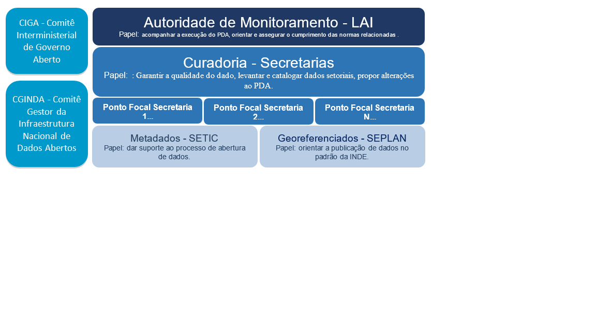

**Plano de Dados Abertos do Ministério do Planejamento**

----------

Versão α - RASCUNHO [2.x.9](https://github.com/planejamentogovbr/PDA-institucional-MP/releases/) de julho/18 - Vigência 2018/2019

# **Sumário**

[TOC]

----------

# **Apresentação**
O Plano de Dados Abertos (PDA) é o documento orientador para as ações de implementação e promoção de abertura de dados no Ministério do Planejamento, Desenvolvimento e Gestão (MP), obedecendo aos padrões mínimos de qualidade, de forma a facilitar o entendimento e a reutilização das informações. É ele quem organiza o planejamento referente à implantação e racionalização dos processos de publicação de dados abertos.

Sua elaboração vem ao encontro do disposto na [Lei de Acesso à Informação (LAI)](http://www.planalto.gov.br/ccivil_03/_ato2011-2014/2011/lei/l12527.htm), na [Instrução Normativa SLTI nº 4](http://dados.gov.br/paginas/instrucao-normativa-da-inda), de 13 de abril de 2012, que institui a Infraestrutura Nacional de Dados Abertos - INDA, no [Decreto Presidencial nº 6.666](http://www.planalto.gov.br/ccivil_03/_Ato2007-2010/2008/Decreto/D6666.htm), de 27 de novembro de 2008, que institui a Infraestrutura Nacio­nal de Dados Espaciais - INDE, bem como dos compromissos assumidos pelo Brasil no âmbito do [3º Plano de Ação Nacional sobre Governo Aberto](http://www.governoaberto.cgu.gov.br/no-brasil/planos-de-acao-1), entre outros normativos que abordam o tema de transparência.

Considerando a existência de cartilhas e modelos que dispõem sobre arquitetura, ontologias e aspectos técnicos relacionados à formatação operacional para a catalogação e publicação de dados, este documento visa orientar o planejamento para a abertura de dados, citando a literatura e materiais disponí­veis sobre o ferramental técnico.

Nessa trilha, são detalhados os principais normativos aplicáveis ao tema, assim como o cenário institucional que possui influência direta no conteúdo do documento, tais como: o [Planejamento Estratégico Institucional (PEI)](http://www.planejamento.gov.br/acesso-a-informacao/institucional/o-ministerio/planejamento-estrategico) e o [Plano Diretor de Tecnologia da Informação e Comunicação (PDTIC)](http://www.planejamento.gov.br/assuntos/secretaria-executiva/dti/sobre-o-pdti) ambos do MP.

A partir das diretrizes estratégicas, este Plano de Dados Abertos prevê no seu Plano de Ação, as ações necessárias para o alcance da sustentabilidade dos resultados pretendidos, estabelecendo a matriz de responsabilidade, a periodicidade e os responsáveis pela atualização constante das bases de dados; além de prever os canais de comunicação e as formas de interação com a sociedade, bem como a matriz de governança e obediência às metodologias e padrões para a correta catalogação e publicação dos dados a serem disponibilizados. 

O presente Plano, referente ao Biênio 2018-2019 e com edição registrada para Julho/2018 foi revisado quanto ao cumprimento das metas dos Plano de Dados anteriores e a inserção de novos dados que serão abertos para a sociedade.

O Plano possui periodicidade bienal, com eventuais novas edições, dentro dessa mesma periodicidade, identificadas no mês de sua liberação, as quais, podem ser motivadas pela revisão do _status_ das metas ou novas inserções de abertura de dados. Esse será divulgado à sociedade por meio de sua publicação no [Portal Brasileiro de Dados Abertos](http://dados.gov.br/organization/ministerio-do-planejamento-desenvolvimento-e-gestao-mp) e no sítio eletrônico do MP.

O Plano foi construído no 1º. Semestre de 2018, de forma colaborativa, envolvendo todas as unidades do MP e considerando os princípios da publicidade e da transparência da administração pública. Para se estabelecer priorização dos conjuntos de dados que serão disponibilizados foram considerados o grau de relevância das informações para o cidadão, os compromissos assumidos pelo Ministério no PDA anterior, além das competências e os conjuntos de dados efetivamente mantidos pelo MP.

O cidadão poderá usar a [plataforma e-Ouv](_https://sistema.ouvidorias.gov.br/publico/Manifestacao/RegistrarManifestacao.aspx_) para relatar problemas técnicos ou inconsistên­cias, devendo a manifestação ser encaminhada à área responsável para resposta e solução, conforme o caso. Os usuários também podem fazer sugestões que serão referência para o aperfeiçoamento e as revisões do PDA.

 ----------
# **I. Introdução**

O MP atualiza o seu PDA para o biênio 2018-2019 documento no qual são estabelecidas as ações para a implementação e promoção de abertura de dados sob sua responsabilidade.

Os principais normativos aplicáveis a confecção deste Plano são:

- A [Lei nº 12.527](http://www.planalto.gov.br/ccivil_03/_ato2011-2014/2011/lei/l12527.htm), de 18 de Novembro de 2011, Lei de Acesso à Informação – LAI;
- O [Decreto nº 8.777,](http://www.planalto.gov.br/ccivil_03/_ato2015-2018/2016/decreto/D8777.htm) de 11 de maio de 2016, que institui a Política de Dados Abertos do Poder Executivo Federal;
- [Resolução CGINDA nº 3](http://wiki.dados.gov.br/Comite-Gestor-da-INDA.ashx#Resolu%C3%A7%C3%B5es_0), de 13 de outubro de 2017, que aprova as normas sobre elaboração e publicação de Planos de Dados Abertos, conforme disposto no Decreto nº 8.777, de 11 de maio de 2016.
- O disposto no art. 48 da [Lei Complementar nº 101](http://www.planalto.gov.br/ccivil_03/leis/LCP/Lcp101.htm), de 4 de maio de 2000, que determina ao Poder Público a adoção de instrument e spnia estão fiscal  em meios eletrônicos de acesso público às informações orçamentárias e prestações de contas;
- O [Decreto Presidencial nº 6.666](http://www.planalto.gov.br/ccivil_03/_Ato2007-2010/2008/Decreto/D6666.htm), de 27 de novembro de 2008, que instituiu a criação da Infraestrutura Nacional de Dados Espaciais – INDE, e determina que o compartilhamento e disseminação dos dados geoespaciais e seus metadados é obrigatório para todos os órgãos e entidades do Poder Executivo Federal, salvo os protegidos por sigilo;
- [Decreto s/nº de 15 de setembro de 2011](http://www.planalto.gov.br/ccivil_03/_ato2011-2014/2011/dsn/dsn13117.htm), que institui o Plano de Ação Nacional sobre Governo Aberto, o qual estabelece o compromisso do governo de implantar a Infraestrutura Nacional de Dados Abertos (INDA);
- A [Instrução Normativa nº 4 de 13 de abril de 2012](http://dados.gov.br/paginas/instrucao-normativa-da-inda), que cria a INDA e estabelece conceitos referentes a dado, informação, dado público, formato aberto, licença aberta, dados abertos e metadado;
- O [Plano de Ação da INDA](http://wiki.dados.gov.br/Plano-de-Acao-da-INDA.ashx) , que institui a necessidade de os órgãos de instituírem seus respectivos Planos de Abertura de Dados, com vistas a uma Política Nacional de Dados Abertos, e institui os elementos mínimos do documento, bem como orienta  d  o t  d dados  oa de a ro  O [Plano de Ação Nacional sobre Governo Aberto](http://www.governoaberto.cgu.gov.br/no-brasil/planos-de-acao-1) (no âmbito da Parceria para Governo Aberto, Open Government Partnership - OGP);
- [Os parâmetros estabelecidos na e-PING](http://eping.governoeletronico.gov.br/) - arquitetura de interoperabieletrônico, e os vocabulários e ontologias de Governo Eletrônico e-VoG e e-MAG - Modelo de Acessibilidade de Governo Eletrônico (instituído pela Portaria nº 03, de 07 de Maio de 2007);
- Os parâmetros atuais ou que venham a ser estabelecidos no âmbito de Planejamento Estratégico Institucional ou setorial, bem como o Plano Diretor de Tecnologia da Informação e Comunicação - PDTIC, sob orientação da [Estratégia de Governança Digital – EGD](http://www.planejamento.gov.br/EGD).

## Cenário Institucional

A elaboração e a revisão do PDA se relacionam e estão alinhadas com os seguintes instrumentos e instâncias de gestão: 

**[1. Planejamento Estratégico Institucional (PEI – MP - 2016-2019)](http://www.planejamento.gov.br/acesso-a-informacao/institucional/o-ministerio/planejamento-estrategico)**
O Planejamento Estratégico do MP está organizado de forma simples e nele constam as definições de missão, visão e as perspectivas que contribuem para a consecução da missão. 

***Missão***: Promover o desenvolvimento, a gestão eficiente, a melhoria do gasto público e a ampliação dos investimentos, visando à oferta de bens e serviços de qualidade ao cidadão.

***Visão***: Ser reconhecido pela excelência e competência na gestão pública.

O PDA está diretamente ligado a um Objetivo Estratégico **"Consolidar a Reorganização Administrativa, com Ênfase na Desburocratização e na Transparência"**, com sua contextualização, Indicador Estratégico, Objetivos de Contribuição das Unidades, Iniciativas e Entregas Estratégicas.

**[2. Plano Diretor de Tecnologia da Informação e Comunicação (PDTIC)](http://www.planejamento.gov.br/assuntos/secretaria-executiva/dti/sobre-o-pdti)** 
O Plano Diretor de Tecnologia da Informação e Comunicação do Ministério do Planejamento, Desenvolvimento e Gestão – PDTIC/MP tem como objetivo atender as necessidades de tecnologia da informação e comunicação das unidades deste Ministério alinhadas aos objetivos estratégicos, visando agregar valor ao negócio. Nesse sentido, ele auxiliará na aplicação dos recursos tecnológicos para a execução das ações deste plano.

**3. Comitê Estratégico de Tecnologia da Informação e Comunicação (CETIC)**
O CETIC criado pela Portaria Nº 385, de 11 de novembro de 2017, possui caráter estratégico permanente de natureza deliberativa e consultiva e tem por finalidade promover a integração entre os objetivos e as diretrizes estratégicas da área de Tecnologia da Informação e Comunicação - TIC com as outras áreas do MP, assim como deliberar e assessorar colegiado superior ou a alta administração sobre políticas, diretrizes e planos relativos à TIC.

**[4. Estratégia de Governança Digital (EGD)](http://www.planejamento.gov.br/EGD)**
O propósito da EGD é orientar e integrar as iniciativas de transformação digital dos órgãos e entidades do Poder Executivo Federal, por meio da expansão do acesso às informações governamentais, da melhoria dos serviços públicos digitais e da ampliação da participação social.
O instrumento foi regulamentado pela Portaria nº 68/2016 do MP, a qual vincula-se ao Decreto nº 8.638/2016, que instituiu a Política de Governança Digital.

**[5. Comitê Gestor da Infraestrutura Nacional de Dados Abertos (CGINDA)](http://wiki.dados.gov.br/Comite-Gestor-da-INDA.ashx)**
O CGINDA criado conforme o art. 5º da Instrução Normativa nº 4, de 12 de abril de 2012, da Secretaria de Logística e Tecnologia da Informação - SLTI, tem por finalidade a gestão da Infraestrutura Nacional de Dados Abertos - INDA, que objetiva formular políticas e estabelecer diretrizes para garantir e facilitar o acesso pelos cidadãos, pela sociedade e, em especial, pelas diversas instâncias do setor público aos dados e informações públicas.
O CGINDA, define uma série de diretrizes para a abertura de dados e apresenta no seu Plano de Ação da INDA ==incluir link pro plano de ação== um modelo orientador a ser seguido pelos órgãos na construção de seus PDAs. 
Destacamos abaixo os temas do Plano de Ação da INDA relacionados à abertura de Dados:
* Realização de 3 turmas do curso de Elaboração de Plano de Dados Abertos, na modalidade à distância; 
* Revisão do Manual de Elaboração do Plano de Dados Abertos; 
* Monitoramento  da Publicação dos Planos de Dados Abertos;
* Normativo da INDA acerca da padronização dos Planos de Dados Abertos ; e
* Monitoramento da implementação dos Planos de Dados Abertos publicados.

**[6. Coordenação da Infraestrutura Nacional de Dados Espaciais (INDE)](http://www.planejamento.gov.br/assuntos/planejamento-e-investimentos/inde)**
O Decreto nº 6.666, de 27/11/2008, que institui, no âmbito do Poder Executivo federal a INDE, define como seus objetivo principais o ordenamento na geração na disseminação e no uso dos dados geoespaciais do País e a utilização, na produção dos dados geoespaciais pelos órgãos públicos. dos padrões e normas estabelecidos pela Comissão Nacional de Cartografia (CONCAR).

**[7. Comissão Nacional de Cartografia (CONCAR)](http://www.concar.gov.br/)**
A Secretaria de Planejamento e Assuntos Econômicos (SEPLAN) do MP esta encarregada de, promover, junto aos órgãos da administração pública, acordos e cooperações, visando ao compartilhamento dos seus acervos de dados geoespaciais.
O PDA do MP segue as orientações da INDE e sempre que o conjunto de dados abertos possuir informações de geolocalização os dados também serão disponibilizados pela rede INDE;

**[8. Comitê Interministerial de Governo Aberto (CIGA)](http://www.governoaberto.cgu.gov.br/no-brasil/comite-interministerial)**
O MP compõe o comitê executivo do CIGA, instituído pelo Decreto s/nº de 15/09/2011. Trata-se do colegiado responsável por orientar a implementação e elaboração dos Planos de Ação do Brasil, contribuindo com o compromisso do País em inovar para fortalecer a transparência dos atos governamentais. 

**[9. Parceria para Governo Aberto (OGP)](https://www.opengovpartnership.org/countries/brazil)**
A 3ª edição do [Plano Brasileiro do Governo Aberto](http://www.governoaberto.cgu.gov.br/no-brasil/planos-de-acao-1) contém os compromissos do MP relacionados à abertura de dados e transparência, a saber: 

* [Compromisso nº 1](https://www.opengovpartnership.org/current-commitments/01-open-data-on-federal-government): Identificar e implementar mecanismos para reconhecer problemas solucionáveis ou mitigáveis a partir da oferta de dados pelo Governo, que atenda expectativas de demandantes e ofertantes.
* [Compromisso n.º 9](https://www.opengovpartnership.org/current-commitments/09-innovation-spaces-management-public-services): Consolidar uma rede aberta no setor público de forma colaborativa e transparente com a sociedade.
* [Compromisso n.º 10](https://www.opengovpartnership.org/current-commitments/09-innovation-spaces-management-public-services): Realizar inventário dos serviços do Poder Executivo Federal e implementar avaliação por meio de mecanismos de satisfação, priorizando serviços para melhoria.
* [Compromisso n.º 14](https://www.opengovpartnership.org/current-commitments/14-social-participation-federal-governments-planning-cycle): Ampliar a participação social no PPA por meio do Fórum Interconselhos.

## Objetivo Geral
 
Promover a abertura de dados pelo MP, zelando pelos princípios da publicidade, transparência e eficiência, visando o aumento da disseminação de informações para a sociedade, bem como a melhoria da qualidade dos dados disponibilizados, de forma a dar maior suporte à tomada de decisão pelos gestores públicos e à participação social na gestão pública.

## Objetivos Específicos

No âmbito do MP, os objetivos específicos ligados à Política de Dados Abertos são:

* Identificar prioridades e disponibilizar dados em formatos abertos, e, sempre que possível, georreferenciados;
* Melhorar a qualidade dos dados disponibilizados;
* Estimular a interoperabilidade de dados e sistemas governamentais pela publicação de dados em formato processável por máquina, conforme padrões estabelecidos;
* Melhorar a gestão da informação e de dados; 
* Incrementar os processos de transparência e de acesso a informações públicas;
* Estimular o consumo das informações produzidas no âmbito da Administração Pública Federal;
* Fomentar a exploração de novos negócios; e
* Priorizar a abertura de dados e a melhoria de qualidade com base nas demandas por dados identificados na sociedade.
 
 ----------

# **II. Estratégia para Abertura**

As ações de abertura de dados que serão implementadas pelo MP seguem os princípios e [as três leis dos dados abertos](http://dados.gov.br/pagina/dados-abertos), bem como premissas e boas práticas comuns dentre os órgãos do governo federal, e estão alinhadas à governança dos projetos de TIC da instituição.

O MP, em virtude do seu papel dentro do Estado Brasileiro, é a instituição responsável pelo funcionamento de diversas plataformas de uso comum por toda a Administração Pública federal, a exemplo do sistema de compras (Comprasnet), de diárias e passagens (SCDP) e de Convênios (Siconv). Nesse sentido deve implementar as estratégias de abertura dos dados destes sistemas de forma centralizada, atendendo às necessidades de publicação de dados comuns por todos os órgãos.

## Premissas

1. Publicar os dados considerados relevantes para a sociedade, no formato disponível informando as eventuais limitações de qualidade dos dados;
2. Avaliar a qualidade dos dados publicados e identificar melhorias a serem realizadas;
3. Sempre que possível publicar dados e seus metadados conforme estabelecido no Plano de Ação da INDA,  seguindo os padrões definidos pela e-PING, pela Infraestrutura Nacional de Dados Abertos - INDA, pela Infraestrutura Nacional de Dados Espaciais – INDE e Governo Eletrônico;
5. Integrar os conjuntos de dados abertos do Ministério ao Portal Brasileiro de Dados Abertos, ponto central de acesso aos dados do Governo Federal;
6. Catalogar os dados geoespacializados na INDE;
8. Manter os dados publicados atualizados e sincronizados com a origem, com a menor periodicidade e maior granularidade possíveis; 
9. A atualização dos dados deve ocorrer preferencialmente, por meio de sincronização automática, estabelecendo-se um processo contínuo, especialmente no caso de sistemas estruturantes, com ganhos de eficiência em comparação às extrações pontuais;
10. Utilizar, como forma de disseminação, os ambientes do Portal Brasileiro de Dados Abertos do Governo Federal. 

## Formatos e Interfaces de acesso aos dados

Para ser considerado aberto de fato, um dado deve estar publicado utilizando-se de um formato aberto e não proprietário como o CSV e JSON.
A escolha pelos formatos e as interfaces tecnológicas de acesso aos dados abertos depende de cada caso específico. Serão levadas em consideração as tecnologias utilizadas no sistema em questão, assim como a capacidade de desenvolvimento da unidade de Tecnologia da Informação, buscando sempre maximizar a reutilização e a precisão semântica das informações.
O MP adotará, sempre que possível, a publicação em diversos formatos e por meio de Interfaces Programáveis de Aplicações - [APIs](https://pt.wikipedia.org/wiki/API).

## Processos de Desenvolvimento de Softwares

Vislumbrando os desafios de caráter tecnológico para implementação deste plano, o MP busca aprimorar as ferramentas e metodologias de desenvolvimento de softwares orientando à criação de soluções com foco no cidadão e na transparência. Para isso o Departamento setorial de TIC tem aprimorado a Metodologia de Desenvolvimento de Software para abarcar as técnicas de dados abertos com as necessidades de negócio de cada plataforma tecnológica. 

Novos sistemas que estão sendo construídos já incluem nativamente os requisitos de abertura, produzindo plataformas tecnológicas convergentes e enxutas, nas quais as interfaces de acesso aos dados (APIs) não são de uso exclusivo dos usuários de dados abertos, mas de todos os aplicativos e interfaces que se utilizam daquele conjunto de dados.

Atualmente, o MP vem investindo cada vez mais no uso de tecnologias de análise e visualização de dados. Tais iniciativas ampliam a capacidade de gestores em tomar decisões baseadas em fatos reais, criando uma cultura corporativa de dados, refletindo positivamente nas iniciativas de abertura de dados e transparência pública. Dentre essas, destacamos o [Painel de Compras](http://paineldecompras.planejamento.gov.br), o [Painel de Preços](http://paineldeprecos.planejamento.gov.br/), o [Painel de Transferências voluntárias](http://www.transferenciasabertas.planejamento.gov.br/), o [Painel de Obras](http://paineldeobras.planejamento.gov.br/) e o [Painel de Custeio Administrativo](http://paineldecusteio.planejamento.gov.br).

 ----------
# **III. Governança**

O PDA está submetido às diretrizes da INDA e da Parceria para Governo Aberto (OGP). A evolução dos compromissos específicos do MP nos Planos de Ação da INDA e OGP é acompanhada pelos respectivos Comitês Gestores CGINDA e CIGA. 

De acordo com § 4º do art. 5º do Decreto 8777/2016, a autoridade designada nos termos do art. 40 da Lei nº 12.527, de 2011, será responsável por assegurar a publicação e a atualização do Plano de Dados Abertos, e exercerá as seguintes atribuições:

I - orientar as unidades sobre o cumprimento das normas referentes a dados abertos;
II - assegurar o cumprimento das normas relativas à publicação de dados abertos, de forma eficiente e adequada;
III - monitorar a implementação dos Planos de Dados Abertos; e
IV - apresentar relatórios periódicos sobre o cumprimento dos Planos de Dados Abertos, com recomendações sobre as medidas indispensáveis à implementação e ao aperfeiçoamento da Política de Dados Abertos. 

As unidades administrativas, por intermédio dos seus pontos focais, são os curadores dos dados mantidos nos sistemas informacionais de sua responsabilidade, e devem, inclusive, primar pela excelência na qualidade dos respectivos metadados.

A unidade setorial de TIC é responsável pelo fornecimento da infraestrutura e demais recursos tecnológicos para garantir a continuidade da disponibilização dos dados e o desenvolvimento de novas soluções de abertura e melhoria dos dados.
  
No caso dos dados georreferenciados, competirá à Secretaria de Planejamento e Assuntos Econômicos (SEPLAN) a coordenação da publicação de dados sob responsabilidade dos demais atores do MP, com apoio da Unidade Setorial de TIC.

O quadro a seguir representa a estrutura de governança do PDA:

## **Sustentação do ambiente de Dados Abertos**

A unidade setorial de TIC tem papel fundamental na viabilização das ações previstas no presente Plano por meio do uso dos recursos tecnológicos. 
A garantia de acesso aos dados abertos subentende a sustentação da infraestrutura tecnológica disponível, atualizada e confiável. 
Para atender a estratégia de abertura definida para este plano a unidade setorial de TIC utilizará no processo de publicação de dados automatização de atualização e implementação de APIs integradas.  

O processo de catalogação dos dados no portal será feito diretamente por cada unidade administrativa responsável pelos dados, observando-se as orientações da Secretaria de Tecnologia da Informação e Comunicação (SETIC) e as diretrizes do PDA. Os pontos focais de cada secretaria utilizarão o Manual de Catalogação para realizar o cadastro, manutenção e revisão dos conjuntos de dados.

No caso de dados georreferenciados, a atualização do catálogo de metadados da INDE serão realizadas pelos pontos focais das secretarias por meio do nó do MP e sob orientação da SEPLAN.

  
# **IV. Monitoramento e Controle**

O PDA será monitorado e acompanhado pela autoridade de monitoramento designada pelo art. 40 da Lei de acesso à informação, conforme Decreto 8.777/2016 assessorado pelo Subcomitê Gestor da Transparência a ser instituído pelo Comitê de Gestão Estratégica - CGE, tendo como membros: 

 - Autoridade de monitoramento;
 - Ouvidor;
 - Chefe de Assessoria de Comunicação;
 - Autoridade máxima da unidade setorial de TIC;
 - Representantes de cada Secretaria;
 - Subsecretario de Assuntos Administrativos; e 
 - Subsecretário de Planejamento e Orçamento.

O subcomitê terá dentre as suas atribuições:
1.	Acompanhar o cumprimento das metas, prazos e produtos previstos no plano de ação do PDA;
2.	Avaliar se as ações adotadas estão aderentes à Política de Dados Abertos;
3.	Monitorar a aplicação de critérios de qualidade e acurácia de dados;
4.	Propor alteração ou inciativas voltadas para melhoria dos dados publicados e uma melhor adequação a política pública;
5.	Monitorar o atendimento as regras da INDA e INDE; e
6.	Elaborar um Relatório Anual reportando o cumprimento dos Planos de Dados Abertos, com recomendações sobre as medidas indispensáveis à implementação e ao aperfeiçoamento da Política de Dados Abertos.
	
Nas reuniões de acompanhamento do PDA, a unidade setorial de TIC informará as estatísticas de publicação e atualização de bases de dados no Portal Brasileiro de Dados Abertos.

## Melhoria da qualidade dos dados 

No presente plano adotamos como premissa a disponibilização de dados relevantes para a sociedade de forma evolutiva, primando pela publicidade tempestiva das informações e o aprimoramento das interfaces de dados já disponibilizadas, buscando entregar cada vez mais valor aos usuários. Isso inclui publicação em mais e diversos formatos, desenvolvimento de Interfaces Programáveis de Aplicativos - APIs, desenvolvimento de ontologias, desenvolvimento e integração com portais de informações gerencias dotados de ferramentas de consultas, disponibilizando os conjuntos de dados de forma mais acessível à sociedade.

## Comunicação e Participação social
A institucionalização do Plano de Dados Abertos, sua governança e revisões serão comunicadas a todo o MP e à sociedade. Dessa forma são envolvidos os setores responsáveis pela publicação dos dados catalogados de modo a disseminar a cultura da transparência e internalizar a publicação de dados na rotina do órgão. Sempre que ocorrer a atualização ou a inserção de dados, ações específicas de comunicação serão realizadas, coordenadas pela ASCOM, de forma a haver ampla divulgação interna e externa ao MP.

Este Plano de Dados Abertos é oficialmente publicado em [plano.dados.planejamento.gov.br](http://plano.dados.planejamento.gov.br) no formato HTML. Dessa maneira o documento é facilmente compartilhável e pode ser lido tanto em telas grandes ou pequenas. 
O documento possui **âncoras** para cada seção possibilitando o compartilhamento de links para partes específicas. Este PDA é originalmente mantido versionado em repositório [Git Público](https://github.com/planejamentoGovBr/PDA-institucional-MP) proporcionando rastreabilidade das alterações no documento. O plano é mantido em formato [Markdown](https://daringfireball.net/projects/markdown/), um estilo de formatação de documentos fácil de aprender, que preserva a legibilidade e é automaticamente convertido em HTML. A combinação destas 2 tecnologias, `Git + Markdown`, permite também a edição online do documento e sua publicação automática em HTML.

Os materiais de divulgação levam em conta os interesses de diferentes segmentos de público: servidores do órgão, gestores públicos, produtores e usuários dos dados, Academia, imprensa, sociedade organizada e cidadão comum (não se vincula a organização ou entidade específica).

O cidadão poderá usar os canais de comunicação do MP para informar o Ministério sobre problemas técnicos ou inconsistências encontradas nos dados publicados, o que será encaminhado à área responsável para tratamento e resposta. Os usuários também podem fazer sugestões para o aperfeiçoamento do PDA. Para fomentar a participação social e, em observância aos princípios da transparência e da publicidade, serão utilizadas as seguintes ferramentas:

==1.	Uso de ambiente colaborativo (Wiki) para discussão e repositório de, a exemplo da wiki.gtinda.ibge.gov.br, conteúdo relacionado às entregas e discussões dos grupos de trabalho afetos ao tema;
2.	Promoção de eventos de dados abertos e concurso de aplicativos, fomentado o uso e reuso de dados públicos;
3.	Consultas Públicas;
4.	Criação de trilhas de participação social;
5.	Catalogação das informações em URL fixa no âmbito do MP, além da publicação no www.inde.gov.br e www.dados.gov.br, conforme natureza do dado;
6.	Publicação de relatório anual, contendo estatísticas de consulta aos dados, uso das APIs e acesso aos dados na fonte;
7.	Publicação de notícias e releases no site do MP e divulgação em outros canais, como perfil institucional do Twitter;
8.	Outros espaços de divulgação.==

# **V. Definição das Ações de Abertura dos Dados**

A garantia dos princípios da publicidade e da transparência da Administração Pública é o pilar deste Plano. Parte-se do pressuposto de que a divulgação dos dados é a regra a ser seguida, tratando-se o sigilo como exceção. Para a definição da priorização das informações a serem disponibilizadas à sociedade, faz-se necessário estabelecer diretrizes para a abertura de bases de dados considerando-se os princípios da legalidade, economicidade e eficiência.

Para tanto foram realizadas dinâmicas com a participação de representantes de todas as secretarias do MP, iniciando com a avaliação dos PDAs anteriores até a aplicação de critérios de priorização dos conjuntos de dados candidatos à abertura neste plano.

Também foi considerada a colaboração da sociedade no processo de melhoria da qualidade através do recebimento de sugestões pelos canais permanentes de comunicação além da realização de uma consulta pública. 

## Identificação de Conjunto de Dados
Apresentamos o detalhamento do processo de identificação de conjunto de dados nos itens abaixo:

**a) Grupo representantes de todas as áreas**
Os representantes das Secretarias do MP se reuniram com objetivo de nivelar o conhecimento quanto a política de dados abertos, avaliar a qualidade dos dados publicados, identificar melhorias a serem realizadas e novos conjuntos de dados a serem disponibilizados. 

**b) Relatório de Acompanhamento e Monitoramento do PDA 2016-2017**
Um insumo importante considerado neste processo foram as informações do Relatório de Acompanhamento e Monitoramento do PDA 2016-2017, onde foram observados os seguintes itens:
* As manifestações nos canais de comunicação: e-Ouv, e-SIC e canal de comunicação da ASCOM com a imprensa;
* O número de acessos aos links do conjuntos de dados disponibilizados no Portal de Dados Abertos;
* Os compromissos do Plano de Ação constante no PDA anterior e que ainda não foram cumpridos;
* Os normativos e compromissos formalmente assumidos pelo Ministério;

**c) Inventário de Bases de Dados**
O grupo de trabalho constituído desenvolveu, dentre as suas atividades, detalhamento maior do inventário de bases do MP observando se já encontravam-se divulgados no Portal de Dados Abertos todos os conjuntos de informações organizadas, constantes de sistemas,  inclusive os estruturantes, planilhas atualizadas regularmente, informações já publicadas em relatórios, sítio institucional, Portal da Transparência, ou ainda, as já organizadas para atender demandas frequentes via e-SIC e e-Ouv.

Este trabalho resultou em uma relação de bases contendo cerca de 40 (quarenta) sistemas em uso no MP, além dos 10 (dez) sistemas estruturantes de uso obrigatório transversal para órgãos da Administração Pública Federal (APF).

Considerando a complexidade de certificar-se que todas as informações disponíveis nas diversas bases geridas no MP se encontram disponíveis em formato aberto, incluiu-se essa atividade no Plano de Ação de Melhoria do presente plano (Sessão VI) no item **MP_M_05 - Estruturação do Inventário de Bases de Dados** que terá como produto uma relação de conjunto de dados a serem disponibilizados em formato aberto e que farão parte do escopo do próximo PDA 2020-2021. 

Para direcionar o escopo deste plano e atendendo a premissa de disponibilizar os dados considerados mais relevantes para a sociedade, o mais rápido possível, nas condições disponíveis, com a qualidade de conteúdo que os dados apresentarem, foi aplicado um filtro no inventário priorizando as ações que aprimoram a qualidade dos conjuntos de dados relativos aos sistemas estruturantes e com maior apelo da sociedade nos canais de comunicação.

Como resultado obteve-se uma seleção com 59 (cinquenta e nove) conjuntos de dados relacionados aos sistemas estruturantes, sendo 39(trinta e nove) já disponibilizados e 20 (vinte) novos conjuntos de dados candidatos à disponibilização em Dados Abertos para este plano. ==incluir planilha da consulta publica (Nitai)==

**d) Consulta Pública**
Entre os dias 02 e 23 de maio, a seleção com 59 (cinquenta e nove) conjuntos de dados ficou em consulta pública para que os cidadãos pudessem manifestar o interesse pela abertura das 20 (vinte) bases ainda não abertas. O objetivo foi incentivar a participação da sociedade e otimizar os esforços para disponibilizar, em formato aberto, a maior quantidade possível de bases de dados do MP.

O resultado da consulta pública influenciou na adequação da oferta de informações deste Ministério à demanda da sociedade sobre os dados abertos que constam no presente Plano.

Cumprindo o compromisso de garantir a transparência do processo  foi publicada a devolutiva da Consulta Pública no Portal Institucional do MP esclarecendo sobre as solicitações de abertura de dados que não serão contempladas neste Plano.

Todo processo de consulta pública foi amplamente divulgado nos seguintes canais:
* Site do Ministério (www.planejamento.gov.br)
* Redes sociais oficiais do Ministério

**e) Critérios para priorização das Bases a serem abertas**
Considerando que a abertura de dados deve, sobretudo, garantir os princípios da publicidade e da transparência da administração pública, a definição das metas de abertura de dados e etapas de priorização, foram baseadas nos critérios relacionados abaixo, aplicados ao resultado da Consulta Pública:

1. Grau de relevância ao cidadão: observando-se as demandas recepcionadas via e-SIC e pelo e-Ouv; os serviços e áreas mais procurados no sítio do MP; consultas a/de jornalistas que demandam o MP; 
2. Estímulo ao controle social;
3. Obrigatoriedade legal ou compromisso assumido: normativos legais e compromissos formalmente assumidos pelo Ministério, inclusive perante organismos internacionais;
4. Refere a projetos estratégicos do MP;
5. Demonstra resultados efetivos de serviços públicos disponibilizados ao cidadão;
6. Capacidade de fomento ao desenvolvimento sustentável;
7. Fomento a negócios;
8. Solicitado em transparência passiva a LAI; e
9. Nível de Maturidade e organização das informações pertencentes ao conjunto de dados abertos.

## **Peso dos Critérios**

| Critério | Nome do Critério  | Peso |
|--:|:--|:--:|
| **C1** | Grau de Relevância ao Cidadão |**4** |
| **C2** | Estímulo ao Controle Social| **3** |
| **C3** | Obrigatoriedade legal ou compromisso assumido| **1** |
| **C4** | Refere a projetos Estratégicos do Governo| **2** |
| **C5** | Demonstra Resultados diretos e efetivos dos serviços públicos disponibilizados ao cidadão pelo Estado| **4** |
| **C6** | Capacidade de fomento ao desenvolvimento sustentável| **3** |
| **C7** | Possibilidade de Fomento a Negócios| **5** |
| **C8** | Solicitado em Transparência Passiva a LAI| **4** |
| **C9** | Nível de maturidade e organização das informações pertencentes ao conjunto de dados abertos| **5** |

## **Matriz de Aplicação de Critérios**

A partir da priorização resultante da Matriz de Critérios , foi elaborado o plano de ação [(sessão VI)](#vi-plano-de-ação) que levou em consideração as informações das diversas áreas de negócios do MP, além da capacidade de execução do Departamento de Tecnologia da Informação e Comunicação. O resultado de todo esse processo de aplicação de critérios consta na tabela abaixo e subsidia a abertura ou melhoria da disponibilização de dados em formato aberto.

| Nome da Base de Dados | C1 | C2 | C3 | C4 | C5 | C6 | C7 | C8 | C9 | Total |
|--:|:--:|:--:|:--:|:--:|:--:|:--:|:--:|:--:|:--:| :--:|
| **Informações sobre a arrecadação anual sobre o Patrimônio da União** | 12 | 9 | 3 | 2 | 12 | 9| 15 | 8 | 15| **85** |
| **Acompanhamento físico das ações** | 12 | 9 | 1 | 6 | 12 | 6 | 10 | 4 | 10 | **70** |
| **Cargos Vagos do Poder Executivo Civil** | 12 | 9 | 1 | 2 | 8 | 3 | 5 | 12 | 15 |**67** |
| **Sistema de Transportes de Servidores Públicos - TaxiGov** | 8 | 9 | 1 | 4 | 4 | 6 | 15 | 4 | 15 | **66** |
| **Programa de Desligamento Voluntário - PDV** | 8 | 9 | 1 | 6 | 8 | 3 | 5 | 8 | 15 | **63** |
| **PPA 2016-2019 - Relacionamento com Objetivos de Desenvolvimento Sustentável** | 8 | 3 | 1 | 6 | 4 | 9 | 5 | 4 | 15 | **55** |
| **Vinculação dos Programas Federais com atributos PPA 2012-2015** | 8 | 3 | 1 | 6 | 4 | 3 | 10 | 4 | 15 |**54** |
| **Gastos de pessoal com Auxílios** | 12 | 9 | 1 | 2 | 4 | 3 | 5| 8 | 10 |**54** |
| **Informações sobre Imóveis Funcionais e Permissionários** | 12 | 6 | 3 | 2 | 4 | 3 | 5 | 8 | 10 |**53** |
| **Plataforma de Análise de Dados da Administração Pública - GovData** | 4 | 3 | 1 | 6 | 8 | 3 | 5 | 4 | 15 |**49** |
| **Catálogo de APIs que integram o ConectaGov** | 4 | 3 | 1 | 6 | 8 | 3 | 15 | 4 | 5 |**49** |
| **Informações do Projeto de Lei de Diretrizes Orçamentárias** | 8 | 6 | 1 | 2 | 4 | 3 | 15 | 4 | 5 | **48** |
| **Catálogo de conjuntos de dados que integram o Portal de Dados Abertos (CKAN)** | 4 | 3 | 1 | 2 | 4 | 3 | 5| 8 | 15 |**45** |
| **Alterações orçamentárias (créditos)** | 8 | 3 | 1 | 6 | 8 | 3 | 5 | 4 | 5 |**43** |
| **Informações sobre o valor de depreciação dos imóveis de Uso Especial** | 4 | 3 | 1 | 2 | 4 | 3 | 5 | 4 | 15 |**41** |
| **Previdência Complementar dos Servidores do Poder Executivo Civil** | 4 | 3 | 1 | 4 | 4 | 3 | 5 | 4 | 10 |**38** |
| **Pensionistas do Poder Executivo Federal** | 4 | 6 | 1 | 2 | 4 | 3 | 5 | 8 | 5 |**38** |
| **Boletim das Empresas Estatais Federais** | 8 | 6 | 1 | 2 | 4 | 3 | 5 | 4 | 5 |**38** |
| **Informações sobre imóveis da antiga RFFSA** | 4 | 6 | 1 | 2 | 4 | 3 | 5 | 4 | 5 |**34** |
| **Relação de órgãos que utilizam a malha da INFOVIA** | 4 | 3 | 1 | 2 | 4 | 3 | 5| 4 | 5 |**31** |

 ----------
# **VI. Plano de Ação**

Esta sessão detalha os planos de ação contendo para cada ação prevista nome e descrição da ação, mês e ano de realização, unidade responsável, produtos e prazo previsto para disponibilidade do conjunto de dados e está dividida em 02 Planos de Ações organizados conforme abaixo:
1.	As ações planejadas para as bases que estão em processo de abertura em formato de dados abertos;
2.	As ações planejadas para as bases que necessitam de ação de melhoria;

Destaca-se que o MP optou por não explicitar o responsável por cada atividade, mantendo como canal único de comunicação com as entidades externas e o público em geral o e-Ouv. Esta decisão visa garantir que toda e qualquer manifestação com relação aos dados abertos possua um registro permitindo uma maior gestão e acompanhamento das dúvidas e problemas na execução das ações previstas neste plano.

## 1. Plano de Ação - Conjuntos de Dados a serem abertos
==justificar os 04 conjuntos de dados que foram para consulta publica e que não tem plano de ação para este plano.==

1. SIAPE |	Pensionistas do Poder Executivo Federal	| Base de Pensionistas do Poder Executivo Federal Civil,  administração direta, autarquias e fundações. Não contempla servidores do Banco Central do Brasil nem as Carreiras de Inteligência da ABIN -  SGP
2. INFOVIA | Relação de órgãos que utilizam a malha da INFOVIA	| Relação de Órgãos que utilizam a malha da INFOVIA	SERPRO	-  SETIC
3. SIOP	| Informações do Projeto de Lei de Diretrizes Orçamentárias	| Propostas colocadas para o Projeto de Lei de Diretrizes Orçamentárias (textos) - SOF
4. SIOP	| Alterações orçamentárias (créditos)	| Detalhes das alterações feitas no orçamento federal em execução - SOF

### **MP_I_01 - Patrimônio União - Arrecadação Patrimonial**
Informações sobre a arrecadação anual aferidas pela União a título de arrecadação sobre Taxa de Aforamento, Taxa de Ocupação, Laudêmio e outras receitas recebidas pelo uso do Patrimônio da União.

   **Atividade:**
   1. Converter em formato para publicação no Portal de Dados Aberto;
   2. Publicar na página de dados aberto da SPU;
   3. Criar link no Portal de Dados Aberto apontando para o site da SPU.

   **Produtos:**
   1. Catálogo com os dados da Arrecadação do Patrimônio da União

   **Frequência de Atualização:** Anual

   **Meta/Prazo:** Setembro/2018

   **Unidade responsável:** SPU

 
### **MP_I_02 - Patrimônio União - Imóveis Funcionais da União**
Sistema de Imóveis Funcionais gerencia as concessões para fins de moradia a servidores deslocados de suas bases originais, pertencentes aos cargos de DAS 4, 5, 6, Especial ou correlatos, no âmbito do DF.

**Atividade:**

   1. Criar Arquivo dom Informações dos Imóveis e Permissionários;
   2. Publicar as informações no Portal de Dados Aberto da SPU;
   3. Criar link no Portal de Dados Aberto apontando para o sítio da SPU.

   **Produtos:**
   1. Catálogo de dados com informações dos Imóveis da união destinados a residência no DF e dos Permissionários.

   **Frequência de Atualização:** Trimestral

   **Meta/Prazo:** Setembro/2018

   **Unidade responsável:** SPU
   **Ponto Focal:** e-Ouv

### **MP_I_03 - Patrimônio União - Valores de depreciação de imóveis**
Perda da plena aptidão da benfeitoria de servir ao fim a que se destina causando a diminuição do valor econômico dos imóveis afetados a administração pública de propriedade da União no transcurso de sua vida útil.

   **Atividade:**
   1. Criar Arquivo com Informações dos Valores dos Imóveis depreciáveis;
   2. Publicar as informações no Portal de Dados Aberto da SPU;
   3. Criar link no Portal de Dados Aberto apontando para o sítio da SPU.

   **Produtos:**
   1. Catálogo de dados dos imóveis e o valor mensal de depreciação do bem.

   **Frequência de Atualização:** Mensal

   **Meta/Prazo:** Setembro/2018

   **Unidade responsável:** SPU

   **Ponto Focal:** e-Ouv

### **MP_I_04 - Servidores do Executivo Federal - Cargos Vagos**
Objetivando o  atendimento a transparência da gestão administrativa  do Governo Federal, e tendo em vista ser um dos temas mais demandados na consulta pública realizada pelo MP, essa ação disponibiliza dados referentes aos cargos efetivos vagos do Poder Executivo Federal Civil, incluindo administração direta, autarquias e fundações. O conjunto de dados não contempla servidores do Banco Central do Brasil nem as Carreiras de Inteligência da ABIN.

   **Atividade:**
   1. Seleção da base de dados: relacionar as vagas aprovadas e vagas ocupadas;
   2. Desenvolvimento de serviço;
   3. Implantação da rotina desenvolvida em produção (SIAPE);
   4. Atualização do catálago de Serviços;
   5. Envio da publicação para dados.gov.br e na INDE, conforme o caso.

   **Produtos:**
   1. Catálago com os cargos vagos do Executivo Federal em formato aberto;
   2. Disponibilização dos Dados de forma automática;
   3. Ambiente preparado;
   4. Dados a serem publicados;
   5. Dados disponibilizados.

   **Frequência de Atualização:** Mensal

   **Meta/Prazo:** Setembro/2018

   **Unidade responsável:** SGP

### **MP_I_05 - Servidores do Executivo Federal - PDV (Programa de Desligamento Voluntário)**
O Governo Federal vem implementando medidas com o objetivo de aumentar a eficiência no serviço público, ao tempo em que busca soluções para a racionalização dos gastos públicos, visando obter crescimento econômico necessário, cuidando de suas atividades precípuas. Dentre essas medidas, inclui-se o PDV, que é um programa de adesão voluntária do servidor público ocupante do cargo efetivo da Administração Pública Federal direta, autárquica e fundacional. O PDV tem como objetivo a diminuição de gastos com pessoal por meio de estímulo à ruptura do vínculo funcional com a União, mediante mecanismo de incentivo financeiro. O Programa de Desligamento Voluntario - PDV foi instituído pela Medida Provisória nº 792 de 26 de julho de 2017 e teve seu prazo de vigência encerrado em 28 de novembro de 2017. O conjunto de dados apresentados não contempla servidores do Banco Central do Brasil nem as Carreiras de Inteligência da ABIN.

**Atividade:**
1. Seleção da base de dados: relacionar dados de Servidores ativos com os indicadores de tipo de incentivo e situação de adesão ao PDV ;
2. Desenvolvimento de serviço;
3. Implantação da rotina desenvolvida em produção (SIAPE);
4. Atualização do catálago de Serviços;
5. Envio da publicação para dados.gov.br e na INDE, conforme o caso.

**Produtos:**
1. Catálago com a relação de Servidores que aderiram ao PDV no Executivo Federal em formato aberto;
2. Disponibilização dos Dados de forma automática;
3. Ambiente preparado;
4. Dados a serem publicados;
5. Dados disponibilizados.

**Frequência de Atualização:** Após publicação da Legislação

**Meta/Prazo:** Setembro/2018

**Unidade responsável:** SGP

### **MP_I_06 - Plano Plurianual (PPA - 2016-2019) - Relacionamento com Objetivos de Desenvolvimento Sustentável**
Esta ação disponibiliza a vinculação dos Objetivos de Desenvolvimento Sustentável com os atributos do PPA 2016-2019.

**Atividade:**
1.  Atualização da base de dados original com as informações de 2017;
2.  Formatação dos dados conforme metodologia padronizada estabelecida no PDA;
3.  Conferência dos Dados;
4.  Criação do dicionário de Dados;
5.  Cadastramento no Dados.gov.br

**Produtos:**
1. Catálogo com as informações sobre PPA e sobre ODS em formato aberto
2. Dados dos Atributos do PPA relacionados aos ODS atualizados anualmente, em formato aberto

**Frequência de Atualização:** Anualmente

**Meta/Prazo:** Novembro/2018

**Unidade responsável:** SEPLAN

### **MP_I_07 - Plano Plurianual (PPA - 2012-2015) - Vinculação atributos com os Programas Federais**
Os Programas Federais são programas desenvolvidos pelo Governo Federal que objetivam a melhoria das condições de vida da população, disponibilizados para os municípios.

O Plano Plurianual (PPA) define as políticas públicas do Governo Federal para um período de 4 anos e os caminhos trilhados para viabilizar as metas previstas.
Esse conjunto de dados contempla a relação de Programas Federais que possuem alguma relação com atributos do PPA 2012-2015, além de informações como regras de adesão aos Programas, contatos e links para mais informações.

**Atividade:**
1. Disponibilização do PPA Mais Brasil e da base de dados original em ambiente de teste pela SETIC;
2. Extração dos dados formatados conforme metodologia padronizada estabelecida no PDA;
3.  Conferência dos Dados;
4.  Criação do dicionário de Dados;
5.  Cadastramento no Dados.gov.br

**Produtos:**
1. Catálogo com as informações sobre PPA e sobre os Programas Federais em formato aberto
2. Dados dos Programas Federais relacionados aos atributos do PPA 2012-2015, em formato aberto

**Frequência de Atualização:** Dados históricos - sem atualização

**Meta/Prazo:** Novembro/2018

**Unidade responsável:** SEPLAN

### **MP_I_08 - Catálogo de conjuntos de dados que integram o [dados.gov.br](http://dados.gov.br)**

O Portal Brasileiro de Dados Abertos utiliza o software CKAN que por sua vez possibilita automatizar o acesso ao catálogo através de APIs. Com isso é possível acessar detalhes dos metadados.

**Atividade:**
1. Validar as informações a serem disponibilizadas via API;
2. Catalogar no Portal de dados abertos;

**Produtos:**
1. Conjunto de dados disponível no Portal Brasileiro de Dados Abertos

**Frequência de Atualização:** Tempo real

**Meta/Prazo:** Setembro/2018

**Unidade responsável:** SETIC

### **MP_I_09 - Patrimônio União - Imóveis da Antiga RFFSA**
Sistema de Arrecadação das Receitas Patrimoniais é o sistema que controla os contratos do patrimônio da Antiga Rede Ferroviária Federal e que ainda produzem efeitos.

**Atividade:**
1. Proceder a Incorporação dos Imóveis nos Sistema da SPU;
2. Publicar as informações dos imóveis da antiga RFFSA.

**Produtos:**
1. Catágolo dos imóveis incorporados ao Patrimônio da União

**Frequência de Atualização:** Mensal

**Meta/Prazo:** Dezembro/2018

**Unidade responsável:** SPU

### **MP_I_10 - Plataforma de Análise de Dados da Administração Pública - [GovData](http://govdata.gov.br/)**

O GovData disponibiliza uma infraestrutura de Datalake, que permite a hospedagem e o cruzamento de grandes volumes de dados. Nele é possível compartilhar informações entre órgãos, mantendo o sigilo e confidencialidade de dados.

Esta ação pretende catalogar a API de acesso ao catálogo das bases de dados que integram a plataforma.

**Atividade:**
1. Validar as informações a serem disponibilizadas;
2. Catalogar no Portal de dados abertos;

**Produtos:**
1. Conjunto de dados disponível no Portal Brasileiro de Dados Abertos

**Frequência de Atualização:** Tempo real

**Meta/Prazo:** Setembro/2018

**Unidade responsável:** SETIC

### **MP_I_11 - Catálogo de APIs de interoperabilidade do SISP - ConectaGov**

O ConectaGov é uma plataforma de gestão de APIs governamentais que pretende simplificar e aprimorar o desenvolvimento e uso de APIs pelos (e para os) órgãos federais que compõem o [SISP](http://sisp.gov.br/). 

Esta ação pretende catalogar a lista de APIs disponíveis no ConectaGov.

**Atividade:**
1. Construir e executar o processo de extração e carga dos dados;
2. Validar as informações a serem disponibilizadas;
3. Publicar dados em formato de dados abertos.

**Produtos:**
1. Extração e carga;  
2. Termo de validação das informações;  
3. Catalogar no Portal Brasileiro de Dados Abertos

**Frequência de Atualização:** Mensal

**Meta/Prazo:** Maio/2019

**Unidade responsável:** SETIC

### **MP_I_12 - Serviço de Transportes Local - TaxiGov**
O MP irá disponibilizar a base de dados das corridas realizadas pelo sistema de transporte de servidores públicos por meio de agenciamento de táxis. Atendendo os critérios de segurança e sigilo, os dados não possuirão a identificação pessoal dos pontos de partidas e de chegada - em formato aberto.

**Atividade:**
1.  Definição e seleção dos dados que serão extraídos de acordo com a visão integrada da área de negócio com as demandas da sociedade;
2.  Formatação dos dados conforme metodologia padronizada estabelecida no PDA;
3.  Conferência dos Dados;
4.  Envio para publicação no Dados.gov.br e na INDE, conforme o caso;
5.  Automatização da extração dos dados via API

**Produtos:**
1. Catálogo com os dados dos atributos do TaxiGov em formato aberto
2. Dados dos Atributos do Taxi atualizados mensalmente, em formato aberto
1. Catálogo validado com os dados dos atributos do TaxiGov em formato aberto
2. Dados dos atributos do Taxi atualizados no portal de dados abertos
5. Publicação dos Dados

**Frequência de Atualização:** Mensal

**Meta/Prazo:** Julho/2019

**Unidade responsável:** SEGES

### **MP_I_13 - Servidores do Executivo Federal - Gasto de Pessoal com Auxílios**
Objetivando o  atendimento a transparência da gestão administrativa  do Governo Federal, e tendo em vista ser um dos temas mais demandados na consulta pública realizada pelo MP, essa ação disponibiliza dados referentes aos Auxílios pagos pelo Poder Executivo Civil, como Auxílio transporte, alimentação, moradia, auxílio restituição de transporte.

**Atividade:**
1. Seleção da base de dados: relacionar as rubricas de auxilio transporte, alimentação, moradia e  restituição de transporte ;
2. Desenvolvimento de serviço;
3. Implantação da rotina desenvolvida em produção (SIAPE);
4. Atualização do catálago de Serviços;
5. Envio da publicação para dados.gov.br e na INDE, conforme o caso.

**Produtos:**
1. Catálago de dados do Executivo Federal com os valores dos auxílios
2. Disponibilização dos Dados de forma automática;
3. Ambiente preparado;
4. Dados a serem publicados;
5. Dados disponibilizados.

**Frequência de Atualização:** Mensal

**Meta/Prazo:** Julho/2019

**Unidade responsável:** SGP

### **MP_I_14 - Empresas Estatais Federais - Boletim**

O Boletim das Empresas Estatais Federais é elaborado trimestralmente pela Secretaria de Coordenação e Governança das Empresas Estatais (SEST), do Ministério do Planejamento, Desenvolvimento e Gestão, e atualmente é publicado [em formato PDF](http://www.planejamento.gov.br/assuntos/empresas-estatais/capa-empresas-estatais-dest). O Boletim reúne dados das Empresas Estatais Federais constantes no Programa de Dispêndios Globais ([PDG](http://www.planejamento.gov.br/assuntos/empresas-estatais/dados-e-estatisticas/programa-de-dispendios-globais-pdg)), no Orçamento de Investimento (OI), no Perfil de Pessoal das Estatais ([PPE](http://www.planejamento.gov.br/assuntos/empresas-estatais/sistemas/documentacao-e-normas/modulo-ppe)) e demais informações divulgadas pelas próprias empresas. Entre as fontes utilizadas estão: o Sistema de Informação das Estatais ([SIEST](https://siest.planejamento.gov.br/gerta/public/pages/login/login.jsp)) e o Sistema Integrado de Planejamento e Orçamento do Governo Federal ([SIOP](https://www.siop.planejamento.gov.br/siop/)).

**Atividade:**
1. Seleção da base de dados e extração a partir do SIEST e SIOP em formato CSV;
2. Formatação dos dados conforme metodologia padronizada estabelecida no PDA;
3. Conferência dos dados;
4. Envio para publicação no Dados.gov.br;
5. Automatização da extração dos dados via API.

**Produtos:**
1. Catálogo com os dados dos atributos do Perfil das Estatais em formato aberto;
2. Dados dos atributos do Perfil das Estatais atualizados trimestralmente em formato aberto;
3. Catálogo com os dados dos atributos de Governança e Avaliação das Estatais em formato aberto;
4. Dados dos atributos de Governança e Avaliação das Estatais atualizados trimestralmente em formato aberto;
5. Catálogo com os dados dos atributos do Orçamento das Estatais em formato aberto;
6. Dados dos atributos do Orçamento das Estatais atualizados trimestralmente em formato aberto;
7. Catálogo com os dados dos atributos de Política de Pessoal e Previdência das Estatais em formato aberto;
8. Dados dos atributos Política de Pessoal e Previdência das Estatais atualizados trimestralmente em formato aberto;
9. Publicação dos Dados

**Frequência de Atualização:** Trimestral

**Meta/Prazo:** Novembro/2019

**Unidade responsável:** SEST

### **MP_I_15 - Orçamento Federal - Acompanhamento Físico e Financeiro das Ações Orçamentárias**
Captação física das ações que compõem o orçamento sendo executado

**Atividade:**
1. Consulta aos órgãos produtores das informações quanto à existência de classificação de sigilo ou proteção por lei referente às mesmas;
2.  Seleção da base de dados (das informações não sigilosas) e extração a partir do SIOP em formato CSV;
3.  Formatação dos dados conforme metodologia padronizada estabelecida no PDA;
4. Conferência dos dados;
5. Envio para publicação nos dados.gov.br e na INDE, conforme o caso.

**Produtos:**
1. Catálogos com os dados que podem ser disponibilizados e aqueles que devem ser protegidos (informações classificadas como sigilosas ou protegidas por lei);
2. Dados não sigilosos do acompanhamento físico e financeiro das ações em formato de dados abertos (.csv);
3. Publicação dos dados.

**Frequência de Atualização:** Anual

**Meta/Prazo:** Novembro/2019

**Unidade responsável:** SOF

### **MP_I_16 - Servidores do Executivo Federal - Previdência Complementar**
Objetivando o  atendimento a transparência da gestão administrativa  do Governo Federal, e tendo em vista ser um dos temas mais demandados na consulta pública realizada pelo MP, essa ação disponibiliza dados referentes à Previdência Complementar dos servidores do Poder Executivo Civil.

**Atividade:**
1. Seleção da base de dados de Servidores Ativos;
2. Desenvolvimento de serviço;
3. Implantação da rotina desenvolvida em produção (SIAPE);
4. Atualização do catálogo de Serviços;
5. Envio da publicação para dados.gov.br e na INDE, conforme o caso.

**Produtos:**
1. Catálogo de dado do Executivo Federal
2. Disponibilização dos Dados de forma automática;
3. Ambiente preparado;
4. Dados a serem publicados;
5. Dados publicados e disponibilizados.

**Frequência de Atualização:** Mensal

**Meta/Prazo:** Dezembro/2019

**Unidade responsável:** SGP

**Ponto Focal:** e-Ouv

## 2. Plano de Ação - Melhoria dos Dados

### **MP_I_01 - Implementação do Portal de Dados Abertos do MP**
O Ministério do Planejamento é o órgão responsável pela política de dados abertos no governo federal, e para isso disponibiliza o portal dados.gov.br que unifica a catalogação de dados no Brasil. Para simplificar a gestão das atividades, o MP sempre catalogou seus dados abertos no portal central. Contudo, pela crescente relevância do tema dentro da Administração Pública Federal, o MP desenvolverá um catálogo próprio que possibilitará dentre outras coisas, maior autonomia na curadoria dos metadados, além de melhorar a comunicação com o público interessado nos dados do Ministério do Planejamento.

   **Atividade:**
   1. Instalar ambiente CKAN específico;
   2. Customizar Arquitetura da informação e Identidade visual do Portal;
   3. Migrar catalogação dos conjuntos de dados do dados.gov.br para ao portal específico;
   4. Capacitar os gestores e curadores dos conjuntos de dados e equipe Ouvidoria;

   **Produtos:**
   1. Ambiente CKAN online exclusivo;
   2. Identidade visual específica;
   3. Metadados Migrados;
   
   **Meta/Prazo:** XXXXXX/2018 ==definir com a Deiop/Setic==

   **Unidade responsável:** Ouvidoria/SETIC

  
### **MP_M_02 - COFIEX - Financiamentos  Externos do Setor Público** 
Os financiamentos externos junto a organismos financeiros internacionais de desenvolvimento bilaterais e multilaterais atendem a projetos da união, estados, distrito federal e municípios. As operações de crédito reembolsáveis no âmbito das esferas estaduais e municipais contam com o aval da União, isto é, são garantidas pela união e a análise é feita pela Comissão de Financiamentos Externos ([Cofiex](http://www.planejamento.gov.br/assuntos/assuntos-internacionais/cofiex)). Ainda passam pela Cofiex, as operações não reembolsáveis como por exemplo as cooperações técnicas.

As informações sobre estes projetos constam no site de dados abertos desde o início da iniciativa, porém, quando o site foi reformulado para disponibilizar as bases mediante links, dada a indisponibilidade de recursos adequados para extrair e disponibilizar as informações, a base ficou fora do site de dados abertos. A expectativa é que até o mês de setembro de 2018 as informações estejam novamente disponíveis no site e com atualizações automáticas e diárias. 

**Atividade:**
1. Seleção da base de dados e extração a partir do SIGS e formatação em arquivo .xls;
2.  Formatação dos dados conforme metodologia padronizada estabelecida no PDA;
3.  Conferência dos Dados;
4.  Envio para publicação no Dados.gov.br e na INDE, conforme o caso.

**Produtos:**
1. Catálogo com os dados referentes aos financiamentos externos;
2.  Publicação dos Dados.

**Frequência de Atualização:** Diário

**Meta/Prazo:** Agosto/2018

**Unidade responsável:** SEAIN

### **MP_M_03 - Viagens a Serviço do Governo Federal** ==validar==
Atendendo a demanda de maior detalhamento das informações de Viagens a Serviço do Governo Federal, O MP planejou uma melhoria agregando maior valor às informações já disponibilizadas no Portal de Dados Abertos.
==Ofertar um conjunto de dados ainda não disponíveis para a sociedade referente ao processo de passagens e diárias do Governo Federal e que atualmente demanda-se bastante por diversos meios==.

**Atividade:**
1.  Definição e seleção dos dados que serão extraídos de acordo com a visão integrada da área de negócio com as demandas da sociedade;
2.  Formatação dos dados conforme metodologia padronizada estabelecida no PDA;
3.  Conferência dos Dados;
4.  Envio para publicação no Dados.gov.br e na INDE, conforme o caso;
5.  Automatização da extração dos dados via API

**Produtos:**
1. Catálogo com os dados dos atributos do SCDP em formato aberto
2. Dados dos Atributos do SCDP atualizados mensalmente, em formato aberto
3. Catálogo validado com os dados dos atributos do SCDP em formato aberto
4. Dados dos atributos do SCDP atualizados no portal de dados abertos
5. Publicação dos Dados

**Frequência de Atualização:** Mensal

**Meta/Prazo:** Agosto/2019

**Unidade responsável:** SEGES

### **MP_M_04 - Revisão dos Metadados dos Conjuntos de Dados** 
O Ministério do Planejamento realiza ações de abertura de dados desde 2011, e atualmente disponibiliza 77 conjuntos de dados através do portal dados.gov.br. Além da ação para criação de portal de dados específico do MP, é essencial a realização de uma ação para reorganização do catálogo. Esta reorganização tem como objetivo principal a melhoria da qualidade dos conjuntos de dados, uma vez que ficou constatado que a falta de documentação e clareza nas informações é um dos principais dificultadores para a busca pelos dados.
Esta ação será realizada como parte do processo de curadoria dos dados e deverá ser realizada com a participação dos gestores das unidades responsáveis pelos dados objetivando também capacitar e desmistificar a atividade de curadoria que deverá ser realizada continuamente.

**Atividade:**
1. Instituir rede dos gestores técnicos responsáveis pelos conjuntos de dados;
2. Definição de um conjunto de orientações para qualificar e padronizar a atividade de curadoria dos conjuntos de dados. Deverá incluir um modelo de redação para descrição, exemplos externos de bons metatados, além de outros;
3. Realizar oficina de catalogação e *brainstorming* de melhorias;
4. Realizar reuniões com as unidades para acompanhar a curadoria dos conjuntos de dados;

**Produtos:**
1. Metadados do Catálogo de dados atualizado;
2. Conjunto de modelos e exemplos de boas catalogações de metadados;
3. Gestores nas áreas capacitados e habilitados a realizarem posteriormente novos ajustes nos metadados;

**Meta/Prazo:** Setembro/2018 ==Definir==

**Unidade responsável:** Ouvidoria

**Ponto Focal:** e-Ouv

### **MP_M_05 - Estruturação do Inventário de Bases de Dados** 
O Inventário de Bases de Dados é um instrumento fundamental para uma boa gestão de políticas de dados abertos. O inventário permitirá aos gestores e cidadãos compreenderem os diversos domínios de informações armazenadas nos bancos de dados do Ministério. Um inventário atualizado e de qualidade assume um papel importante na gestão do conhecimento institucional, refletindo na qualidade das decisões de médio e longo prazo.
Esta ação tem como objetivo principal garantir o aprimoramento do inventário, identificando os conjuntos de dados pertencentes as bases já disponibilizadas e, principalmente identificando as informações que ainda carecem ser disponibilizadas  "qualificando-as para comporem o PDA para o ciclo seguinte (2020 e 2021)". Em outras palavras, é uma ação preparatória para o próximo ciclo de planejamento.

**Atividade:**
1. Estudo para levantamento das bases de dados através do portólio de sistemas, aplicativos, painéis/dashboards, etc;
2. Estudo para levantamento das bases de dados através de engenharia reversa dos Sistemas de Gerenciamento de Bancos de Dados (SGBDs);
3. Estudo para mapeamento detalhado entre o inventário atualizado e os respectivos conjuntos de dados já abertos possibilitando visualizar a completude e as necessidades de novas ações de melhoria;
4. Definição de indicadores globais e específicos para medir a evolução/maturidade do processo de abertura de dados do ministério;
5. Normalização das informações e publicação em formato MarkDown juntamente com o Plano de Dados Abertos vigente;

**Produtos:**
1. Inventário das bases de dados atualizado;
2. Mapeamento da completude da abertura dos dados de cada domínio de dados;
3. Conjunto de fichas técnicas de indicadores para acompanhamento da evolução das ações;

**Meta/Prazo:** Agosto/2019 ==Definir==

**Unidade responsável:** Secretaria Executiva

**Ponto Focal:** e-Ouv

# GLOSSÁRIO ==validar==

Os termos abaixo referem-se às definições apresentadas no Plano de Ação da INDA. 

**Dado:** sequência de símbolos ou valores, representados em algum meio, produzidos como resultado de um processo natural ou artificial. 
Entende-se que dados são observações ou o resultado de uma medida (por investigação, cálculo ou pesquisa) de aspectos característicos da natureza, estado ou condição de algo de interesse, que são descritos através de representações formais e, ao serem apresentados de forma direta ou indireta à consciência, servem de base ou pressuposto no processo cognitivo (HOUAISS, 2001 ; SETZER, 2001 ;)

**Dados abertos:** dados públicos representados em meio digital, estruturados em formato aberto, processáveis por máquina, referenciados na rede mundial de computadores e disponibilizados sob licença aberta que permita sua livre utilização, consumo ou cruzamento;
Dado público: qualquer dado gerado ou sob a guarda governamental que não tenha o seu acesso restrito por legislação específica;

**e-PING:** Padrões de Interoperabilidade de Governo Eletrônico – define um conjunto mínimo de premissas, políticas e especificações técnicas que regulamentam a utilização da Tecnologia de Informação e Comunicação (TIC) na interoperabilidade de serviços de Governo Eletrônico, estabelecendo as condições de interação com os demais Poderes e esferas de governo e com a sociedade em geral.

**e-VoG:** Vocabulários e Ontologias do Governo Eletrônico é um conjunto de padrões, ferramentas e metodologias para possibilitar: o intercâmbio de informações com acordo semântico, de forma a viabilizar o pronto cruzamento de dados de diversas fontes; o uso de metodologias de modelagem conceitual como forma de elicitação do conhecimento tácito das áreas de negócio de governo; o uso de ontologias como ferramenta para explicitar conhecimentos de maneira formal e coerente; o alinhamento conceitual das diversas áreas do conhecimento do governo. Um dos produtos do e-VoG é o Repositório de Vocabulários e Ontologias de Governo Eletrônico (http://vocab.e.gov.br/), local para acesso a todas as referências ontológicas do Governo Eletrônico Federal.

**Formato aberto:** formato de arquivo não proprietário, cuja especificação esteja documentada publicamente e seja de livre conhecimento e implementação, livre de patentes ou qualquer outra restrição legal quanto à sua utilização;
Informação: dados, processados ou não, que podem ser utilizados para produção e transmissão de conhecimento, contidos em qualquer meio, suporte ou formato; 
A informação é gerada a partir de algum tratamento ou processamento dos dados por parte do seu usuário, envolvendo, além de procedimentos formais (tradução, formatação, fusão, exibição, etc.), os processos cognitivos de cada indivíduo (MACHADO, 2002 ; SETZER, 2001).

**Licença aberta:** acordo de fornecimento de dados que conceda amplo acesso para que qualquer pessoa os utilize, os reutilize, e os redistribua, estando sujeito a, no máximo, a exigência de creditar a sua autoria e compartilhar pela mesma licença;

**Linked Data:** conjunto de boas práticas para publicação de dados estruturados de maneira a facilitar seu compartilhamento e integração;

**Dados ou informação Geoespacial:** aquele que se distingue essencialmente pela componente espacial, que associa a cada entidade ou fenômeno uma localização na Terra, traduzida por sistema geodésico de referência, em dado instante ou período de tempo, podendo ser derivado, entre outras fontes, das tecnologias de levantamento, inclusive as associadas a sistemas globais de posicionamento apoiados por satélites, bem como de mapeamento ou de sensoriamento remoto;

**Metadados:** conjunto de informações descritivas sobre os dados, incluindo as características do seu levantamento, produção, qualidade e estrutura de armazenamento, essenciais para promover a sua documentação, integração e disponibilização, bem como possibilitar a sua busca e exploração.

**Git:**

**Markdown:**

## SIGLAS ==incluir sistemas==
**MP:** Ministério do Planejamento, Desenvolvimento e gestão
**ASCOM:** Assessoria de Comunicação
**SOF:** Secretaria de Orçamento Federal
**SEAIN:** Secretaria de Assuntos Internacionais
**SEGES:** Secretaria de Gestão
**SETIC:** Secretaria de Tecnologia da Informação e Comunicação
**SGP:** Secretaria de gestão de Pessoas
**SPU:** Secretaria de Patrimônio da União
**SDI:** Secretaria de Desenvolvimento da Infraestrutura
**SEST:** Secretaria de Coordenação e Governança das Empresas Estatais
**SEPLAN:** Secretaria de Planejamento e Assuntos Econômicos
**COFIEX:** Comissão de Financiamento Externo
**SCDP:**
**SIGS:**
**SIAPE:**
**SIOP:**

*[HTML]: Hyper Text Markup Language

<!--stackedit_data:
eyJoaXN0b3J5IjpbLTE5NDkxNjIwMjYsLTg5OTg2MTE1OSwxNj
Q5MzI2MDIsMTE1MjYyNTQ2NCwtNjUxMjQ2MTI5LDExMDYyMjY3
MjEsLTY2ODgwMjI1MiwtMTE3MDUxMzU0NSwtMTExMjA1NTYxMy
wyMDA4NjI1NjY3LDYwNDE3Njk2LDE2MzgwNDQ5ODMsLTIxMzky
NzY2MjcsLTgzMzI5MTI5OCw0NTkwNzAxNTEsMTY0MjIyMDY2Ny
wtMTUxNTE4MDA3MCwtMTczNTMxMzgwMSwtMTQ1NjgyNTU3OCwt
MjExNjg2MTFdfQ==
-->